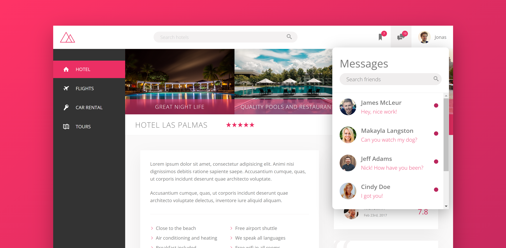

# Trillo

This is a fully responsive page for a fictional hotel website called 'Trillo'.

## Link

Check it out here: https://trillo-nickm.netlify.app

## Screenshots

 

 

 

 

 

## Description

This is the second project in Jonas Schmedtmann's Advanced CSS and SASS course. The focus of this particular project is FlexBox and all layouts and positioned elements utilize FlexBox to provide a comfortable and aesthetically pleasing UI. I added a few extra features to his base application, such as drop-down menus on the notifications, messages, and profile tabs in the top navigation bar, along with animated captions for the three primary hotel images.

## Features

This page features an animated search bar that slightly expands upon clicking the field. The sidebar also features a unique hover animation implementing the color theme of the page. Finally, the 'Show all' and 'Book now' buttons near the bottom of the page also include some hover animation for a more interactive user experience. The website is also fully responsive.

## Technology

HTML
 
CSS
 
SASS/SCSS
 
Mobile responsiveness
 
npm autoprefixer, concat, npm-run-all, postcss, postcss-cli (to prefix, compile, and compress all CSS)

## Questions:

Feel free to contact me at mully7773@gmail.com if you have any questions.  
You can view more of my projects at https://github.com/Mully7773.
